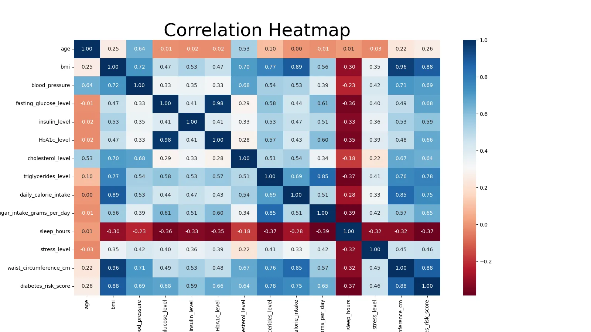
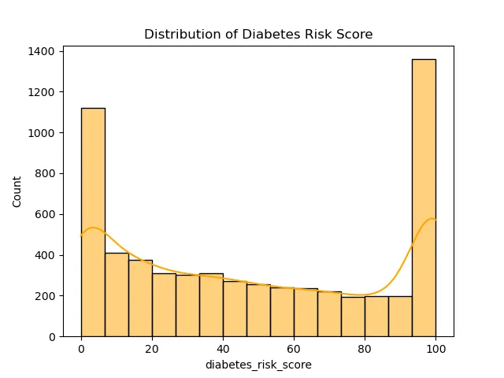
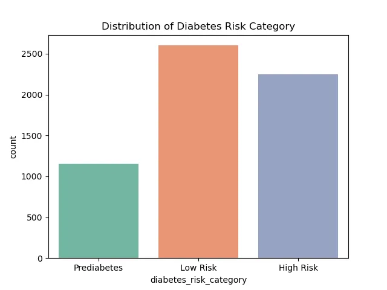
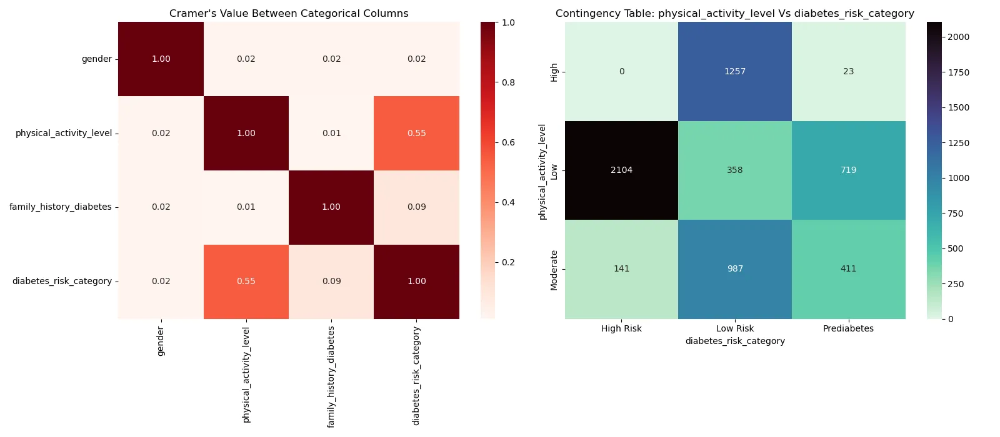
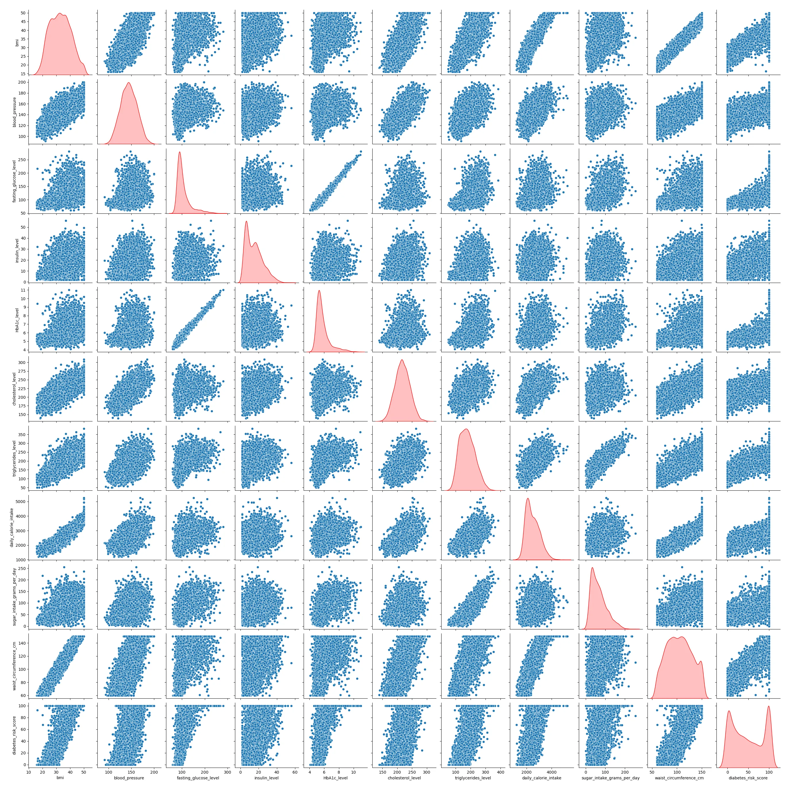
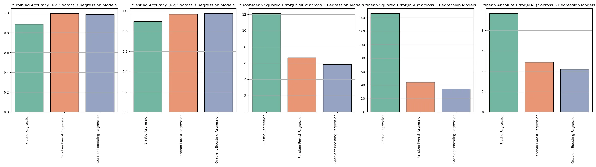
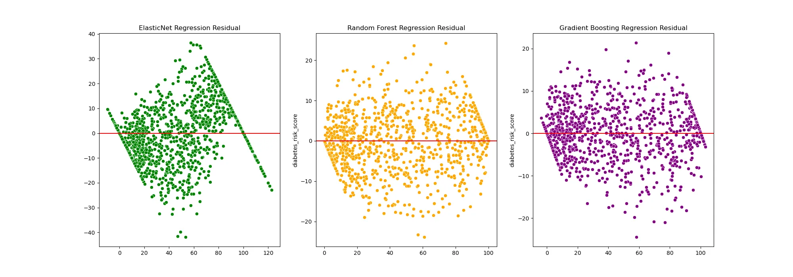
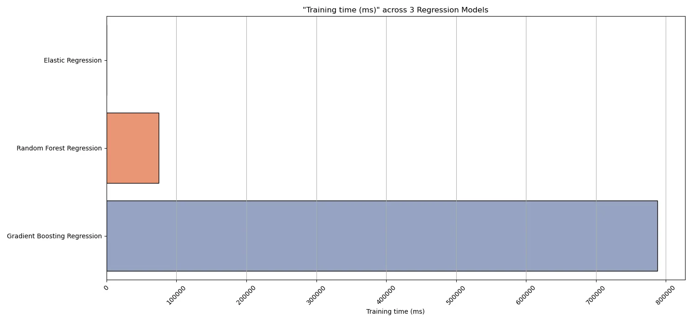
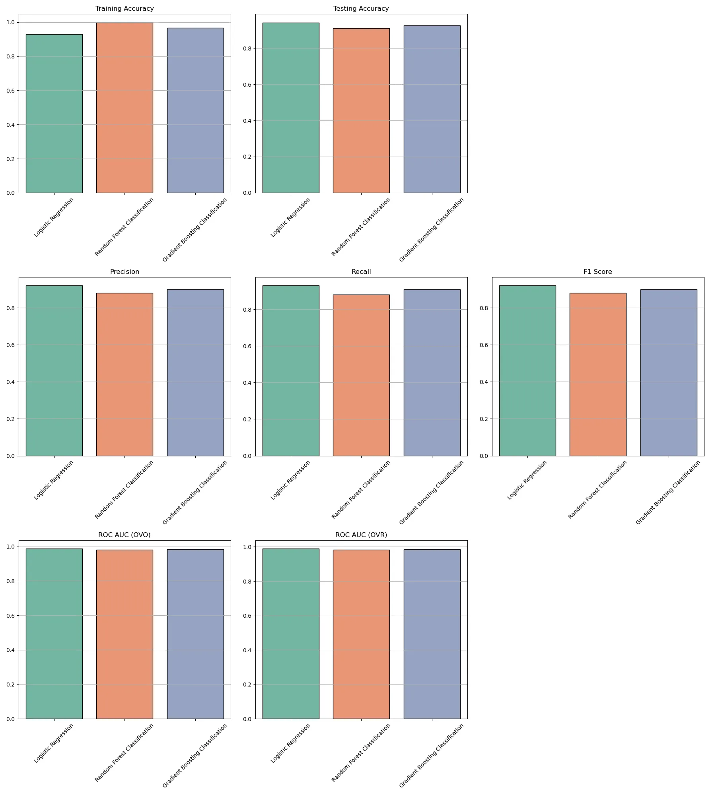
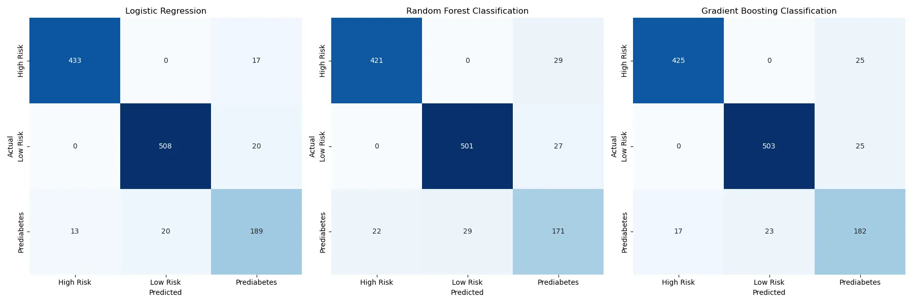

# Diabetes Risk Data Analysis & Prediction

A comprehensive data science pipeline to assess and predict diabetes risk levels based on clinical health markers, using a dual-modeling approach — regression for continuous risk scoring and classification for categorical risk assessment.

---

## Project Structure


```
diabetes-risk-analysis/
├── dataset/
│   └── diabetes_risk_dataset.csv       # Raw clinical data
├── models/
│   └── [model_files].joblib            # Persisted trained models
├── plots/
│   ├── classifications/
│   │   ├── classification-models-metric-comparison.webp
│   │   └── confusion-matrix-comparison.webp
│   ├── eda/
│   │   ├── correlation-heatmap.webp
│   │   ├── distribution-of-diabetes-risk-category.webp
│   │   ├── distribution-of-diabetes-risk-score.webp
│   │   ├── feature-selection-using-cramers-value.webp
│   │   └── pair-plots-of-all-features.webp
│   └── regressions/
│       ├── regression-metrics-comparision.webp
│       ├── regression-training-time.webp
│       └── residual-plots-comparison.webp
├── diabetes_risk_data_analysis.ipynb   # Main analysis & modeling notebook
├── requirements.txt                    # Project dependencies
└── README.md                           # Project documentation
```

---

## Analysis Workflow

### Phase 1 — Data Acquisition & Profiling
- Audit the raw dataset for structural integrity
- Verify dimensions, missing values, and duplicate records

### Phase 2 — Exploratory Data Analysis (EDA)
- Explore patterns using descriptive statistics and visual distribution plots
- Assess multicollinearity using Variance Inflation Factor (VIF)

### Phase 3 — Preprocessing & Feature Engineering
- Handle outliers using Winsorization
- Scale and encode features for model readiness
- Create domain-specific features (e.g., **Glucose-A1c Interaction Index**) to capture non-linear health risks

### Phase 4 — Model Development

**Regression** — predicting continuous `diabetes_risk_score`:
- ElasticNet
- Random Forest
- XGBoost

**Classification** — predicting categorical risk tiers (`Low`, `Prediabetes`, `High-Risk`):
- Logistic Regression
- Random Forest
- XGBoost

### Phase 5 — Evaluation & Optimization
- Tune models using `GridSearchCV`
- Evaluate regression models using MAE, RMSE, and R²
- Prioritize **recall for high-risk patients** to minimize medical false negatives

---

## Model Comparison

### Regression — Risk Scoring

| Model                        | RMSE | MAE | R² Score |
|-----------------------------|------|-----|----------|
| ElasticNet Regression       | 12.10  | 9.66 | 0.89      |
| Random Forest Regression    | 6.66  | 4.88 | 0.96      |
| Gradient Boosting Regression| **5.83**  | **4.18** | **0.97**      |

### Classification — Risk Tiers

| Model                        | Accuracy | Precision | Recall | F1-Score |
|-----------------------------|----------|-----------|--------|----------|
| Logistic Regression         | **0.94**      | **0.92**       | **0.93**    | **0.92**      |
| Random Forest Classifier    | 0.91      | 0.88       | 0.88    | 0.88      |
| Gradient Boosting Classifier| 0.93      | 0.90       | 0.91    | 0.90      |

---

## Pre-Trained Models

Pre-trained model files are available as `Models.zip` located at `./models`. Extract the contents into the `models/` directory before running the notebook if you wish to skip the training phase.

​```bash
unzip ./models/Models.zip -d ./models/
​```

> **Important Notice — Loading vs. Training**
>
> The saved `.joblib` files contain only the **fitted model objects** (e.g., the best estimator from `GridSearchCV`). They do not retain the full `GridSearchCV` session state. If you load a model instead of training it, you may encounter errors when the notebook attempts to access attributes that are only populated during a live training run, such as:
>
> - `grid_search.best_score_`
> - `grid_search.best_params_`
> - `grid_search.cv_results_`
>
> **To avoid these errors**, either re-run the training cells in full, or ensure that any cells referencing these attributes are skipped when operating in load-only mode. It is recommended to check each cell's intent before executing when using pre-trained models.

---

## Getting Started

### 1. Clone the Repository
​```bash
git clone https://github.com/your-username/diabetes-risk-analysis.git
cd diabetes-risk-analysis
​```

### 2. Install Dependencies
​```bash
pip install -r requirements.txt
​```

### 3. Run the Analysis
Open `diabetes_risk_data_analysis.ipynb` in Jupyter Notebook or VS Code and follow the pipeline from data exploration through to model evaluation.

---

## Visualizations

### Exploratory Data Analysis

**Correlation Heatmap**
Displays pairwise Pearson correlations between all clinical features, helping identify redundant or highly correlated predictors prior to modeling.



---

**Distribution of Diabetes Risk Score**
Shows the spread and shape of the continuous target variable across the dataset, revealing skewness or class imbalance in risk scoring.



---

**Distribution of Diabetes Risk Category**
Illustrates the class balance across the three categorical risk tiers — Low, Prediabetes, and High-Risk — informing classification strategy.



---

**Feature Selection Using Cramer's V**
Measures the association strength between categorical features and the risk category target, supporting informed feature selection.



---

**Pair Plots of All Features**
Provides a matrix of scatter and distribution plots across all features, highlighting inter-feature relationships and potential clusters by risk category.



---

### Regression Results

**Regression Metrics Comparison**
Side-by-side comparison of MAE, RMSE, and R² across ElasticNet, Random Forest, and XGBoost regression models.



---

**Residual Plots Comparison**
Visualizes prediction residuals for each regression model, assessing bias, variance, and heteroscedasticity patterns.



---

**Regression Training Time**
Compares the computational cost of training each regression model, useful for evaluating the performance-efficiency trade-off.



---

### Classification Results

**Classification Models Metric Comparison**
Compares Accuracy, F1-Score, and Recall (High-Risk) across Logistic Regression, Random Forest, and XGBoost classifiers.



---

**Confusion Matrix Comparison**
Displays the confusion matrices for all classification models side by side, highlighting true/false positive and negative rates per risk tier.



---

**Regression Training Time**
Compares the computational cost of training each regression model, useful for evaluating the performance-efficiency trade-off.


---

## Future Improvements
- Use Advanced model like Deep Learning
- Implementation of model comparison analysis
- Use of cross-validation techniques
- Integration of preprocessing pipelines
- Optimization of model hyperparameters
- Transform data distribution to match model assumptions (Linear assumption,...)
- Use feature engineering methods such as: Forward Selection, Backward Elimination,... and compare with Regularization methods

These enhancements will further strengthen the robustness and applicability of the developed models.

---

## Requirements

​```
numpy
pandas
scipy
statsmodels
seaborn
matplotlib
scikit-learn
xgboost
joblib
​```

> Install all dependencies via `pip install -r requirements.txt`